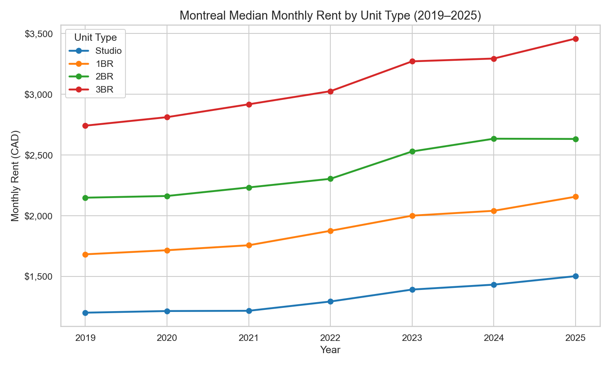
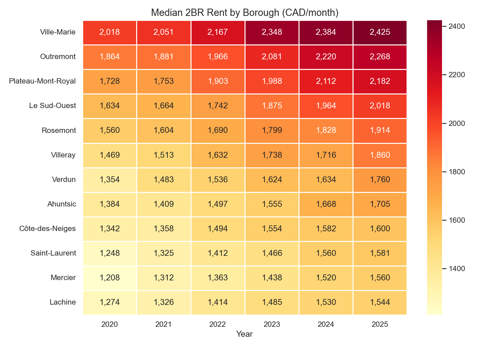
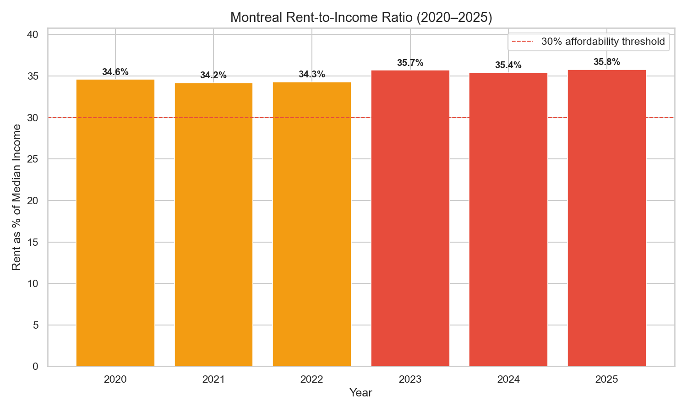
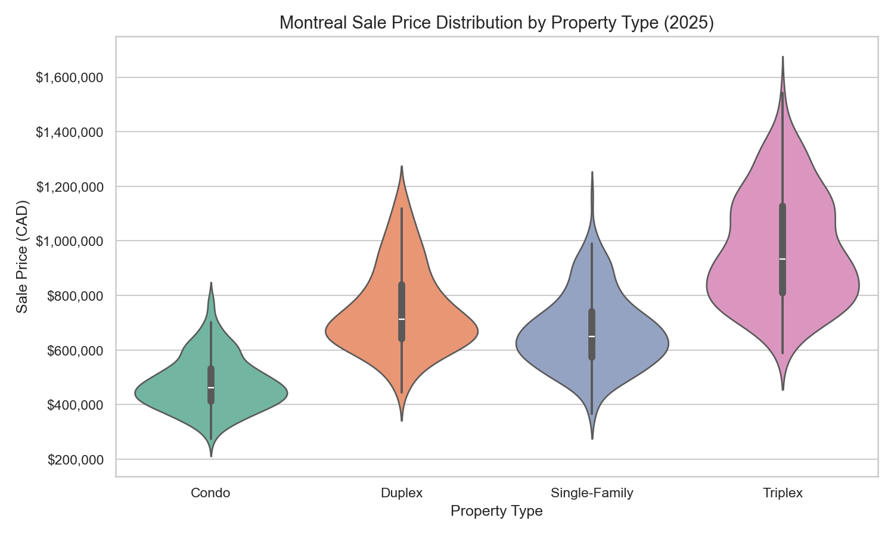
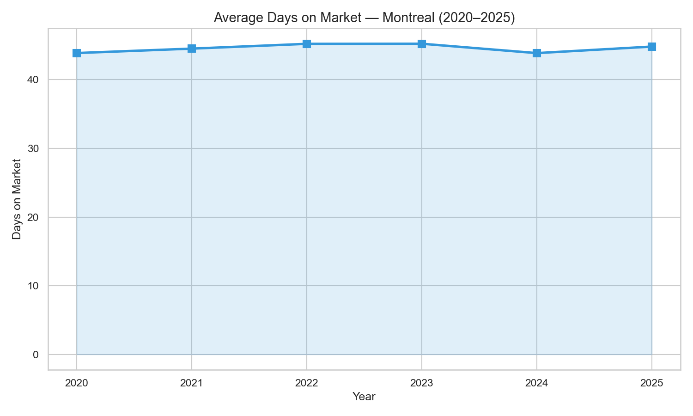

# 🏠 Montreal Housing Market Analysis

[](https://github.com/yumorepos/montreal-housing-analysis/actions/workflows/ci.yml)


**A data analysis project exploring rental trends, affordability, and sales patterns across Montreal boroughs (2020–2025).**

[](https://www.python.org)
[](https://pandas.pydata.org)
[](LICENSE)

## Overview

This project analyzes Montreal's housing market across 12 boroughs, covering both rental and sales data from 2020–2025. It demonstrates data wrangling, statistical analysis, and visualization skills using Python's data science stack.

### Key Findings

| Metric | Value |
|--------|-------|
| 2025 city-wide median rent | **$1,848/mo** |
| 5-year rent increase | **23.2%** |
| Rent-to-income ratio (2025) | **35.8%** ⚠️ |
| Most expensive borough | Ville-Marie ($2,425/mo) |
| Least expensive borough | Lachine ($1,544/mo) |
| Average days on market | 45 days |
| Median condo price (2025) | $462,000 |

> ⚠️ Montreal's rent-to-income ratio has crossed the 30% affordability threshold — indicating housing stress for median-income households.

## Visualizations

### Rental Trends by Unit Type


### Borough Heatmap (2BR Median Rent)


### Affordability Over Time


### Sale Price Distribution (2025)


### Days on Market Trend


## Dataset

This analysis uses **synthetic data** modeled on real Montreal market ranges from:
- [CMHC Rental Market Reports](https://www.cmhc-schl.gc.ca/professionals/housing-markets-data-and-research)
- [Centris Quebec](https://www.centris.ca/en/tools/real-estate-statistics)
- [Statistics Canada](https://www.statcan.gc.ca/)

Synthetic generation ensures reproducibility while reflecting realistic price ranges, borough premiums, and year-over-year trends observed in actual market data.

**Dataset size:** 14,400 rental listings + 5,760 sales records across 12 boroughs.

## Tech Stack

- **Python 3.12** — core language
- **Pandas** — data wrangling & aggregation
- **NumPy** — numerical operations & synthetic data generation
- **Matplotlib** — chart rendering
- **Seaborn** — statistical visualizations

## Getting Started

```bash
git clone https://github.com/yumorepos/montreal-housing-analysis.git
cd montreal-housing-analysis
pip install -r requirements.txt
python analysis.py
```

Output charts and CSV data will be saved to `output/`.

## Project Structure

```
montreal-housing-analysis/
├── analysis.py          # Main analysis script (data gen → analysis → visualization)
├── requirements.txt     # Python dependencies
├── README.md
└── output/
    ├── rentals.csv      # Generated rental dataset
    ├── sales.csv        # Generated sales dataset
    ├── 01_rent_trends.png
    ├── 02_borough_heatmap.png
    ├── 03_affordability.png
    ├── 04_sales_distribution.png
    └── 05_days_on_market.png
```

## Author

**Yumo Xu** — [GitHub](https://github.com/yumorepos) · [Portfolio](https://yumorepos.github.io)
